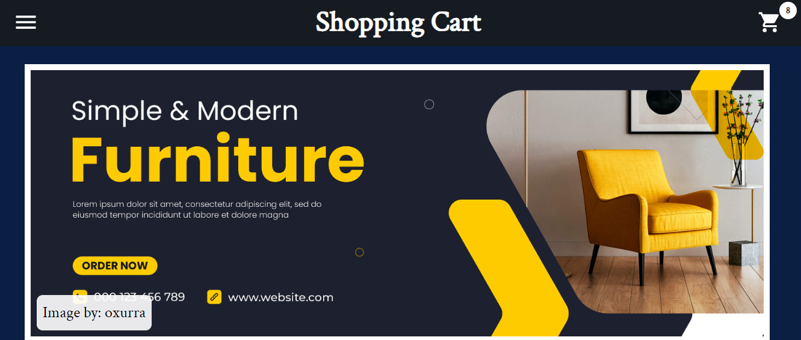
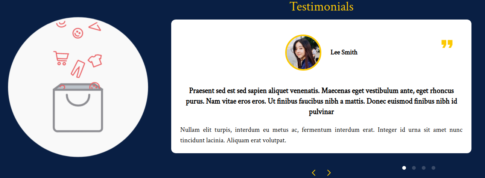
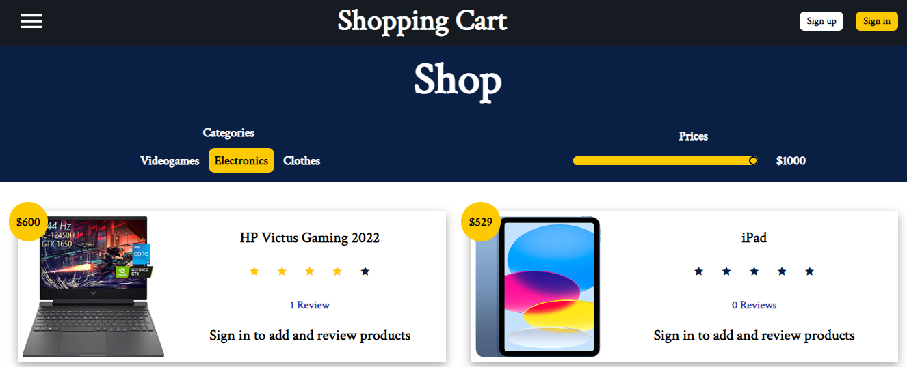
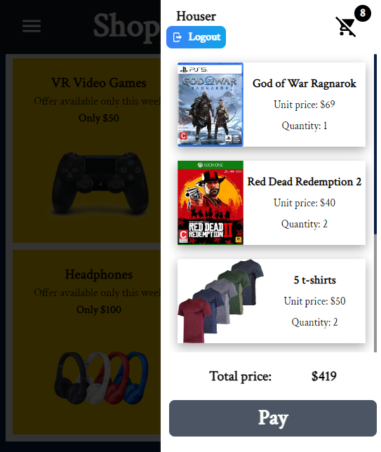
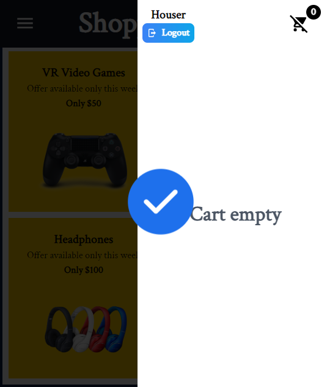
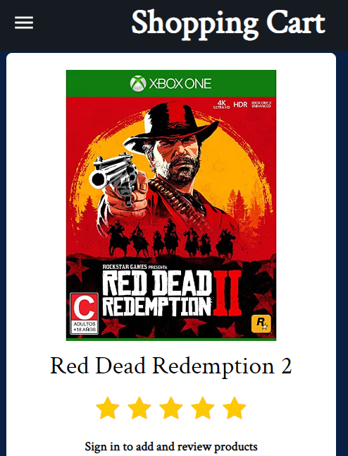
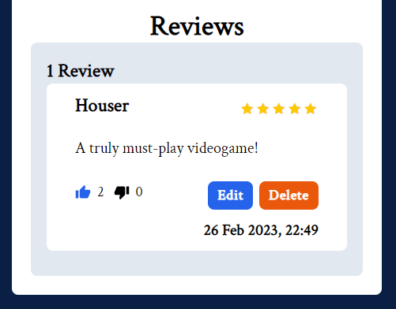

# Shopping-Cart App using React, NodeJS, MongoDB, Passport and Tailwind

  

The project simulates a shopping cart application, which was created by means of:
* React and Tailwind for the frontend.
* NodeJS and MongoDB for backend management and user data storage.
* An API created for the communication between the client and the server.
* Passport for user authentication and API path protection.

The application has two main routes: Home and Shop.

In the Home path users are greeted with the presentation of the application, showing the different categories that a real application would contain, as well as the features of the 'company' and a testimonials section.

  

The Shop path displays the items present in the store, which can be filtered according to their category and a certain price range. In addition, the items have a button to add a certain quantity of items to the cart and a review button, where these buttons are only displayed if the user is logged in. Finally, the items have a certain number of stars to display an average of the rating that other users have left.

  

Upon authentication, users can start adding items to their cart, which will display them in a list and indicate the total price according to the products added. Also, by pressing the 'Pay' button, the cart is cleared and an animation is displayed to indicate that the simulated purchase process has been successful.

  

  

On the other hand, users can review the items in the store, where they can indicate the rating of the item by means of stars and leave a comment about the product. Also, users can delete the reviews made by them or edit them. Finally, users can dislike or like reviews to convey their support to other user's reviews.

  

  

